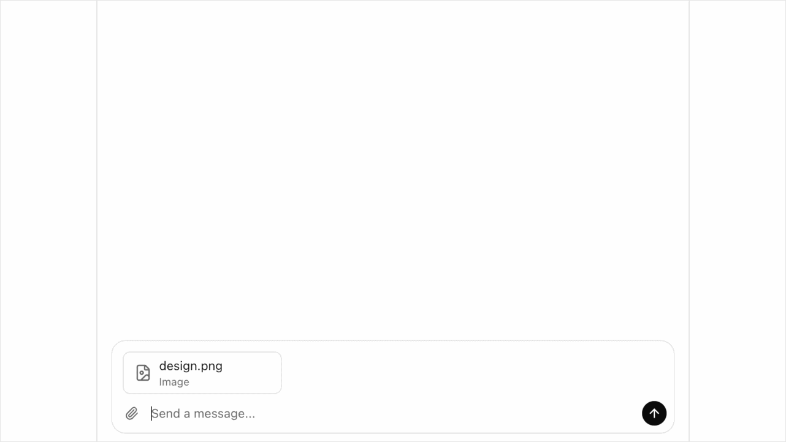

# llm-chat-ui

Portable LLM chat UI for React, Vue, and Angular. Plug in any model, get streaming chat with reasoning steps, tool use, file attachments, and markdown.

<p align="center">
  
</p>

## Install

```bash
npm install llm-chat-ui
```

## Quick Start

```tsx
import { useChat, createSSEAdapter } from "llm-chat-ui"

const adapter = createSSEAdapter({ url: "/api/chat" })

function Chat() {
  const { messages, send, isStreaming, clear } = useChat({ adapter })
  return /* your UI */
}
```

Copy styled components into your project:

```bash
npx llm-chat-ui add            # React (Tailwind)
npx llm-chat-ui add --vue      # Vue 3 (scoped CSS)
npx llm-chat-ui add --angular  # Angular (inline CSS)
```

## Adapters

```typescript
// Your own SSE backend
createSSEAdapter({ url: "/api/chat" })

// Direct to OpenAI
import { createOpenAIAdapter } from "llm-chat-ui/adapters/openai"
createOpenAIAdapter({ apiKey: "sk-...", model: "gpt-5.4-mini" })

// Direct to Anthropic
import { createAnthropicAdapter } from "llm-chat-ui/adapters/anthropic"
createAnthropicAdapter({ apiKey: "sk-ant-...", model: "claude-sonnet-4-6-20250217" })

// Custom
const adapter: ChatAdapter = {
  async *stream({ message, history, files }) {
    yield { type: "text_delta", delta: "Hello!" }
    yield { type: "done" }
  },
}
```

## SSE Protocol

Your backend streams `data: {json}\n\n` events:

| Event | Fields | Purpose |
|-------|--------|---------|
| `text_delta` | `delta` | Streaming text |
| `reasoning` | `delta` | LLM thinking |
| `tool_start` | `id, name, icon?, args?` | Tool begins |
| `tool_done` | `id, count?, summary?` | Tool completes |
| `replace_text` | `text` | Replace full response |
| `done` | | Stream complete |
| `error` | `message` | Error |

## Framework Support

| | React | Vue | Angular |
|--|-------|-----|---------|
| State hook | `useChat()` | `useChat()` via `llm-chat-ui/vue` | DIY with adapter |
| Components | TSX + Tailwind | Vue SFCs | Standalone + inline CSS |
| Markdown | react-markdown | markdown-it | marked |
| Icons | lucide-react | lucide-vue-next | inline SVG |

Angular must use subpath imports (`llm-chat-ui/adapters/sse`, `/parser`, `/types`) to avoid React bundling.

## Features

- **Streaming** -- real-time text, reasoning, and tool events via SSE
- **Reasoning steps** -- expandable thinking/tool steps with breath animation
- **Tool use** -- configurable icons per tool, result counts, expandable details
- **File attachments** -- opt-in via `enableFileUpload` prop, metadata only
- **Actions** -- suggested follow-ups via `:::actions` content blocks
- **Custom blocks** -- register parsers for any `:::type` block
- **Framework agnostic** -- core adapters/parser work in any JS environment

## License

MIT
